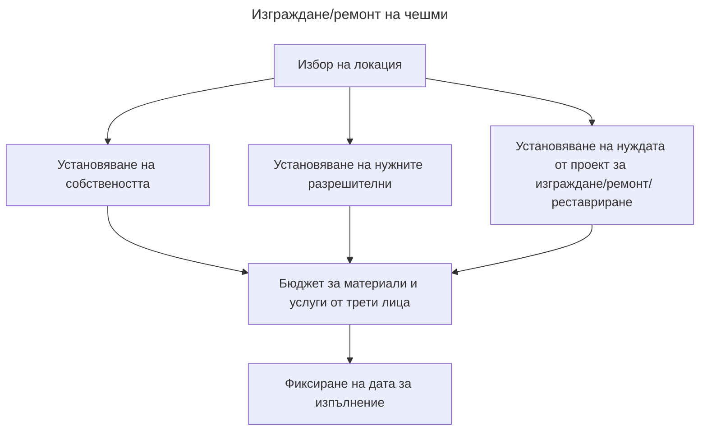

# Проекти

```mermaid
---
title: Изграждане/ремонт на чешми
---
flowchart TD
    A[Избор на локация] --> B[Установяване на собствеността] & C[Установяване на нужните разрешителни] & D["Установяване на нуждата от проект за \n изграждане/ремонт/реставриране"] --> E[Бюджет за материали и услуги от трети лица] --> F[Фиксиране на дата за изпълнение]

```