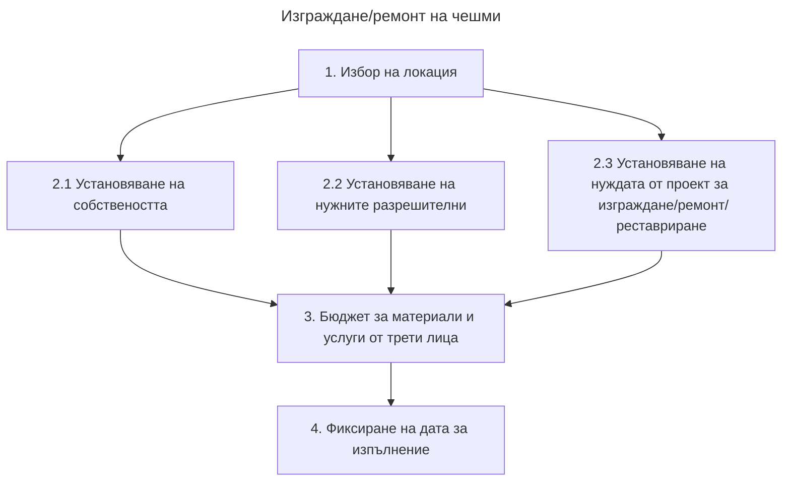

# Проекти

```mermaid
---
title: Изграждане/ремонт на чешми
---
flowchart TD
    A[1. Избор на локация] --> B[2.1 Установяване на собствеността] & C[2.2 Установяване на нужните разрешителни] & D["2.3 Установяване на нуждата от проект за \n изграждане/ремонт/реставриране"] --> E[3. Бюджет за материали и услуги от трети лица] --> F[4. Фиксиране на дата за изпълнение]

```